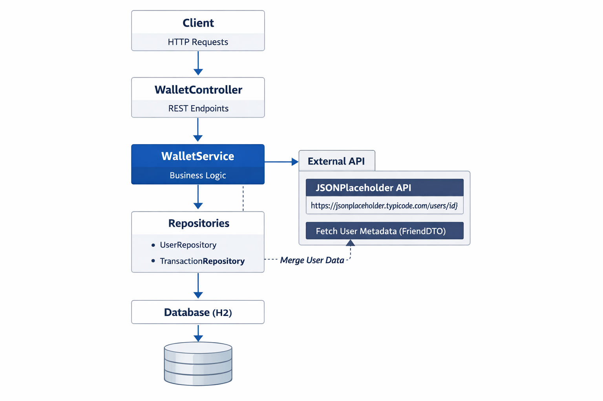

# 💸 Send Money Service

A Spring Boot backend service that provides wallet balance, money
transfer, transaction history, transaction details, and friend list
retrieval.

This project simulates a digital wallet system where authentication is
handled by an upstream gateway via the `X-User-Id` header.

---

## 🛠 Tech Stack

- Java 17
- Spring Boot
- Spring Data JPA
- H2 Database (file-based)
- Maven
- RESTful APIs

---

## ▶️ How to Run the Application

### ✅ Option 1 -- Using Docker

docker compose up --build

### ✅ Option 2 -- Run directly inside the Repo

./mvnw spring-boot:run

### ✅ Option 3 -- Using Maven

mvn spring-boot:run

### ✅ Option 4 -- Using IntelliJ

Run the main class:

SendMoneyServiceApplication

---

## 🌐 Application URLs

Base URL:

http://localhost:8080

H2 Console:

http://localhost:8080/h2-console

JDBC URL:

If app runs locally.

jdbc:h2:file:./walletdb

If Running you're on docker.

jdbc:h2:file:/app/data/walletdb

---

## 🔐 Authentication Simulation

All APIs require a header:

X-User-Id: `<user-id>`{=html}

---

## Sample cURL Commands

Run these while the app is running on `http://localhost:8080`.

### 1. Get Wallet Balance

curl -X GET "http://localhost:8080/api/wallet/balance" -H "X-User-Id: 1"

### 2. Send Money

curl -X POST "http://localhost:8080/api/wallet/send?receiverId=2&amount=100" -H "X-User-Id: 1"

### 3. Get Friend List

curl -X GET "http://localhost:8080/api/wallet/friends" -H "X-User-Id: 1"

### 4. Get Transaction History

curl -X GET "http://localhost:8080/api/wallet/transactions" -H "X-User-Id: 1"

### 5. Get Transaction Details

curl -X GET "http://localhost:8080/api/wallet/transactions/2" -H "X-User-Id: 1"

# 📌 API Documentation

## 1️⃣ Get Wallet Balance

GET /api/wallet/balance

## 2️⃣ Send Money

POST /api/wallet/send

## 3️⃣ Get Transaction History

GET /api/wallet/transactions

## 4️⃣ Get Transaction Details

GET /api/wallet/transactions/{id}

## 5️⃣ Get Friend List

GET /api/wallet/friends

---

# 🧠 Business Logic

✔ User can only access their own data\
✔ Balance validation\
✔ Daily transfer limit\
✔ Transactional money transfer

---

# 🌐 External Integration

Friend names are fetched from:

https://jsonplaceholder.typicode.com/users/{id}

---

# 🏗️ Architecture

### WalletService

Contains all business logic and keeps controllers thin.

### FriendDTO

Returns only required fields to prevent overfetching.

### H2 Database

Lightweight and file-based for persistence.

---

# 📊 Logging

The application logs all critical actions for auditing and tracing.

---

## 📐 Class Diagram (Conceptual)

Controller\
→ WalletService\
→ UserRepository / TransactionRepository\
→ Database

Entities: - User - Transaction

DTO: - FriendDTO

---

## 🔄 Sequence Diagram -- Send Money Flow

Client\
→ WalletController\
→ WalletService

WalletService performs: 
1. Validate sender & receiver
2. Check balance
3. Check daily limit
4. Deduct sender balance
5. Add receiver balance
6. Save transaction
7. Return response

---

## 🚀 Future Improvements

- Unit & Integration tests
- Global exception handler
- Pagination for transactions
- JWT authentication
- OpenAPI / Swagger documentation

---

# ⏱ Time Spent

\~ 8 hours

---

# 👨‍💻 Author

Stephen Ypil